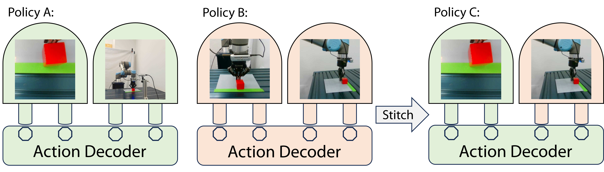
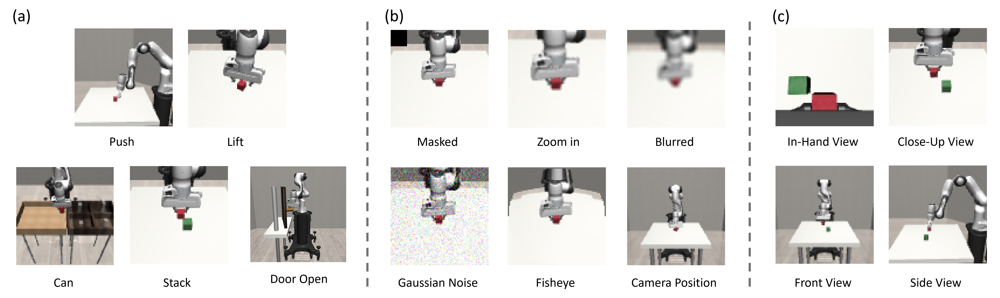

# Perception Stitching: Zero-Shot Perception Encoder Transfer for Visuomotor Robot Policies

[Pingcheng Jian](https://pingcheng-jian.github.io/),
[Easop Lee](https://www.linkedin.com/in/easoplee),
[Zachary Bell](https://www.linkedin.com/in/zachary-bell-976b55142),
[Michael M. Zavlanos](https://mems.duke.edu/faculty/michael-zavlanos),
[Boyuan Chen](http://boyuanchen.com/)
<br>
Duke University
<br>

### [Project Website](https://generalroboticslab.com/PerceptionStitching) | [Video](https://youtu.be/H6SD9Tcvhrg) | [Paper](http://arxiv.org)

## Overview
This repo contains the implementation for the paper *Perception Stitching: Zero-Shot Perception Encoder Transfer for Visuomotor Robot Policies*.



## Citation

If you find our paper or codebase helpful, please consider citing:

```
@article{jian2024perception,
  title={Perception Stitching: Zero-Shot Perception Encoder Transfer for Visuomotor Robot Policies},
  author={Pingcheng Jian and Easop Lee and Zachary Bell and Michael M. Zavlanos and Boyuan Chen},
  year={2024},
  eprint={2406.19971},
  archivePrefix={arXiv},
  primaryClass={cs.RO},
  url={https://arxiv.org/abs/2406.19971}, 
} 
```


## Content

- [Installation](#installation)
- [Training](#training)
- [Testing](#testing)

## installation
- The development tools of this project can be installed with conda:
``` 
$ conda env create -f pes_env.yml .
```

## training
1. Example of training with Perception Stitching method
```
python pes_train.py --device cuda:0 --save_model --seed 101 --process1 --effect blur
```

2. Example of training with Perception Stitching (with L1 and L2 regularization) method
```
python pes_l1l2_train.py --device cuda:0 --save_model --seed 101 --process2 --effect fisheye
```

3. Example of training with Perception Stitching (without disentanglement regularization) method
```
python pes_without_disent_train.py --device cuda:0 --save_model --seed 101 --process1 --effect zoomin
```

4. Example of training with Cannistraci et al. 2024 (linear sum) baseline
```
python linear_sum_train.py --device cuda:0 --save_model --seed 101 --process2 --effect mask
```

5. Example of training with Cannistraci et al. 2024 (non-linear sum) baseline
```
python nonlinear_sum_train.py --device cuda:0 --save_model --seed 101 --process1 --effect noise
```

## testing
1. Example of testing the policy trained with Perception Stitching method
```
python pes_test.py --device cuda:0 --vision1 robot0_eye_in_hand --vision2 agentview --effect blur
```

2. Example of testing the policy trained with Perception Stitching (with L1 and L2 regularization) method
```
python pes_l1l2_test.py --device cuda:0 --vision1 robot0_eye_in_hand --vision2 agentview --effect fisheye
```

3. Example of testing the policy trained with Perception Stitching (without disentanglement regularization) method
```
python pes_without_disent_test.py --device cuda:0 --vision1 robot0_eye_in_hand --vision2 agentview --effect zoomin
```

4. Example of testing the policy trained with Cannistraci et al. 2024 (linear sum) baseline
```
python linear_sum_test.py --device cuda:0 --vision1 robot0_eye_in_hand --vision2 agentview --effect mask
```

5. Example of testing the policy trained with Cannistraci et al. 2024 (non-linear sum) baseline
```
python nonlinear_sum_test.py --device cuda:0 --vision1 robot0_eye_in_hand --vision2 agentview --effect noise
```

Experiment setup in the simulation


Experiment setup in the real world


## License

This repository is released under the Apache License 2.0. See [LICENSE](LICENSE) for additional details.

## Acknowledgement

This project refers to the github repositories [robomimic](https://github.com/ARISE-Initiative/robomimic), 
[robosuite](https://github.com/ARISE-Initiative/robosuite), and 
[relreps](https://github.com/lucmos/relreps).

